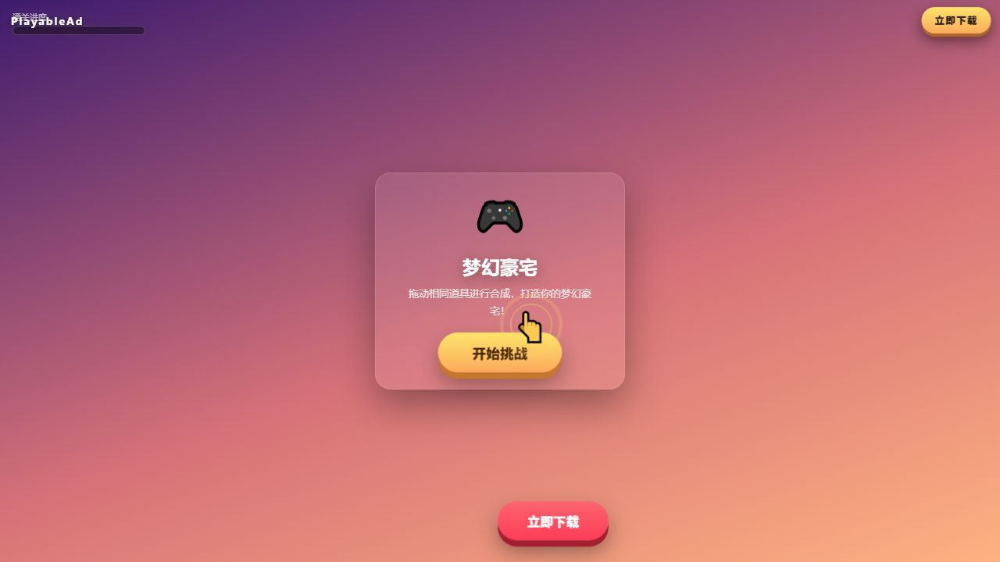
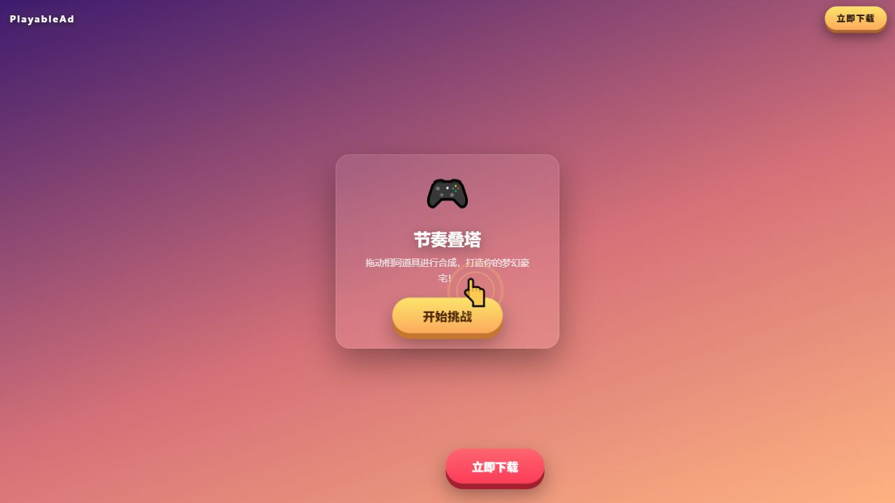
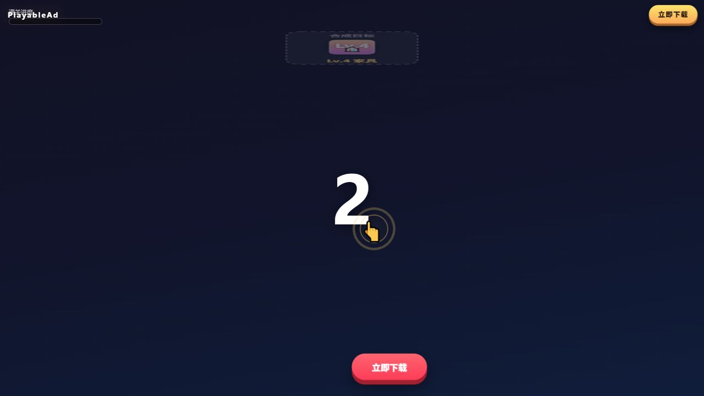
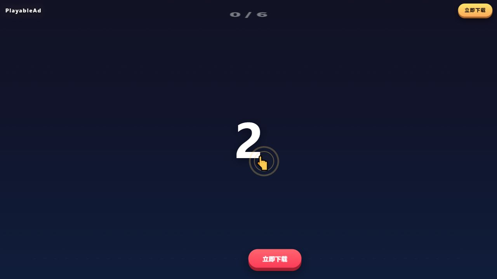

# Playable Factory

一个面向试玩广告（Playable Ads）的多 Agent 生产管线：把策划 brief 转成可运行的单文件 H5，并在交付前完成规则化 QA。

> Portfolio showcase：这个仓库展示需求解析、玩法规划、RAG 组件召回、代码装配、自动修复、人工审核和交付质量门禁。原项目中的渠道成品、音视频和投放素材包没有放入公开仓库。

## What this demonstrates

```text
brief.txt
   │
   ▼
Parse Agent ──► Plan Agent ──► Component Agent (RAG)
                                      │
                                      ▼
                              Codegen Agent
                                      │
                                      ▼
                  QA Agent ── pass ──► Human Review ──► H5
                      │
                      └── fail + remaining budget ──► Codegen
```

- LangGraph 状态图：显式状态、条件路由和 QA 回炉环。
- 两种运行模式：默认 `mock` 离线可复现；`--live` 使用 OpenAI 兼容接口。
- 轻量 RAG：本地稳定哈希向量召回 + 玩法亲和度/冲突规则/历史先验重排。
- 代码生成：玩法模板、组件片段和通用投放壳装配成一个 HTML 文件。
- 质量门禁：结构、CTA、MRAID 降级链、占位符、包体等检查，拒绝使用动态 `eval` 规则。
- Human-in-the-Loop：QA 通过后在 `human_review` 节点暂停，人工确认后才落盘。
- 可观测性：每个节点产生可序列化的 `trace`，记录状态、修复轮次和耗时。
- 换皮 Agent：从内嵌 HTML 中提取、分类、按用户要求替换素材，再重新封装成单文件 H5。

## Screenshots

These screenshots are captured from real generated H5 outputs in mock mode.

| Drag Merge | Stack Build |
| --- | --- |
|  |  |
|  |  |

## Quick start

```powershell
python -m venv .venv
.\.venv\Scripts\Activate.ps1
pip install -r requirements.txt

# 完全离线，默认不访问网络；跳过人工审核用于演示/CI
python main.py --mock --no-review --brief examples/brief_merge.txt --out outputs/merge.html
```

用浏览器打开 `outputs/merge.html` 即可试玩；同目录会生成 `merge_qa_report.json`。`outputs/` 已被 `.gitignore` 忽略，避免把生成物误提交。

运行自测：

```powershell
python tests/self_test.py
```

换皮 Agent 示例：

```powershell
python tools/skin_swap.py extract path\to\playable.html --out-dir skin\demo
python tools/skin_swap.py plan skin\demo --request examples\skin_request.json
python tools/skin_swap.py embed skin\demo path\to\playable.html --out outputs\demo_skinned.html
```

它会生成 `manifest.json`、`asset_catalog.json`、`replacement_plan.json` 和
`.skin_report.json`，用于展示每个素材的分类、替换原因、引用次数和回嵌后的审计结果。

Live 模式只从环境变量读取凭据：

```powershell
$env:LLM_API_KEY = "在当前终端临时设置，不要写入文件"
$env:LLM_BASE_URL = "https://api.openai.com/v1"  # 也支持兼容服务
python main.py --live --no-review --brief examples/brief_merge.txt
```

仓库不会保存、读取或上传 `.env`；请勿把真实 key 粘贴进代码、README、Issue 或提交历史。

## Project map

```text
main.py                     # CLI、人工审核中断、产出 QA 报告
src/state.py                # LangGraph 共享状态与 reducer
src/graph.py                # Agent 节点、条件边、HITL 节点
src/telemetry.py            # 节点 trace 与运行摘要
src/agents.py               # parse / plan / component / codegen / QA
src/llm.py                  # mock/live 抽象与稳健 JSON 解析
src/rag.py                  # 哈希向量召回、规则重排、冲突处理
src/renderer.py             # H5 壳、模板与组件装配
src/templates/              # drag_merge / stack_build / balloon / tomb
components/library.yaml     # 玩法与增强组件知识库
components/snippets.py      # 可复用的前端组件片段
tools/skin_swap.py          # 内嵌 data URI 素材提取/灌回工具
tools/audit_html.py         # 独立静态交付审计器
tests/self_test.py          # 离线节点测试 + 端到端 smoke test
```

换皮流水线的详细设计见 [docs/skin_swap_agent.md](docs/skin_swap_agent.md)。

## Design decisions

### 为什么不是一个大 Prompt

每个 Agent 只负责一类决策，状态在节点间显式传递。QA 失败时只回到 codegen，避免从需求解析重新开始；同时每一步都可以单独测试、替换或接入人工审核。

### RAG 如何真正参与生成

规划 Agent 先选择组件名，Component Agent 再用语义召回、玩法亲和度和冲突规则完成排序。Codegen 只接收命中的组件片段，而不是把整个知识库塞进 prompt；这样组件复用边界清晰，也方便解释每次命中原因。


## Extending the system

1. 在 `src/templates/` 新增一个玩法模板。
2. 在 `components/library.yaml` 注册玩法和可选组件。
3. 给新玩法添加一个 `examples/*.txt` brief。
4. 在 `tests/self_test.py` 增加解析、规划、渲染和 QA 断言。

编排图不需要为每个新模板增加分支：模板选择、组件召回和渲染通过状态与知识库连接。

## License

MIT，见 [LICENSE](LICENSE)。
